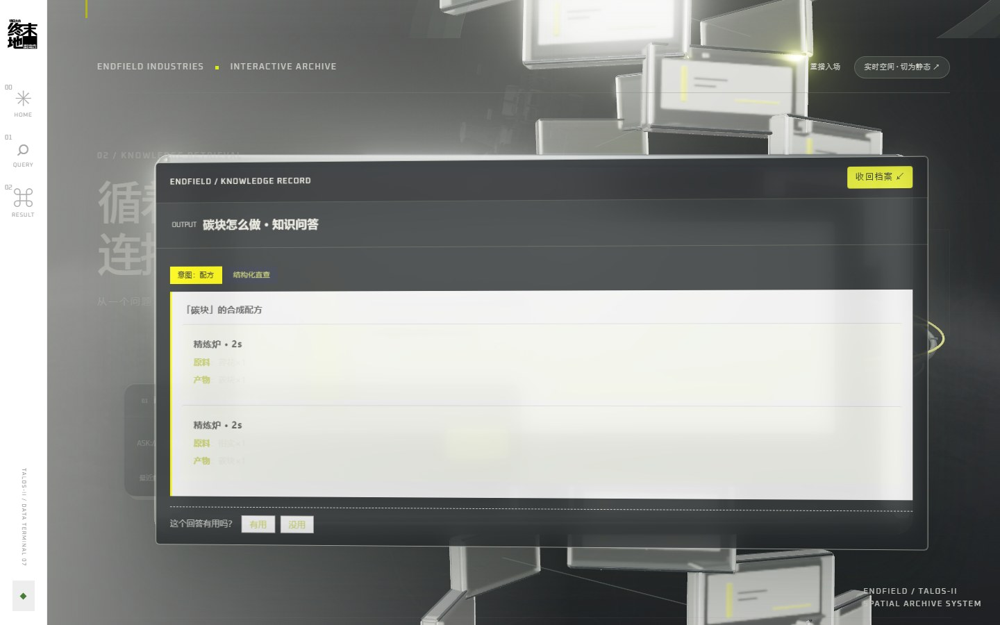
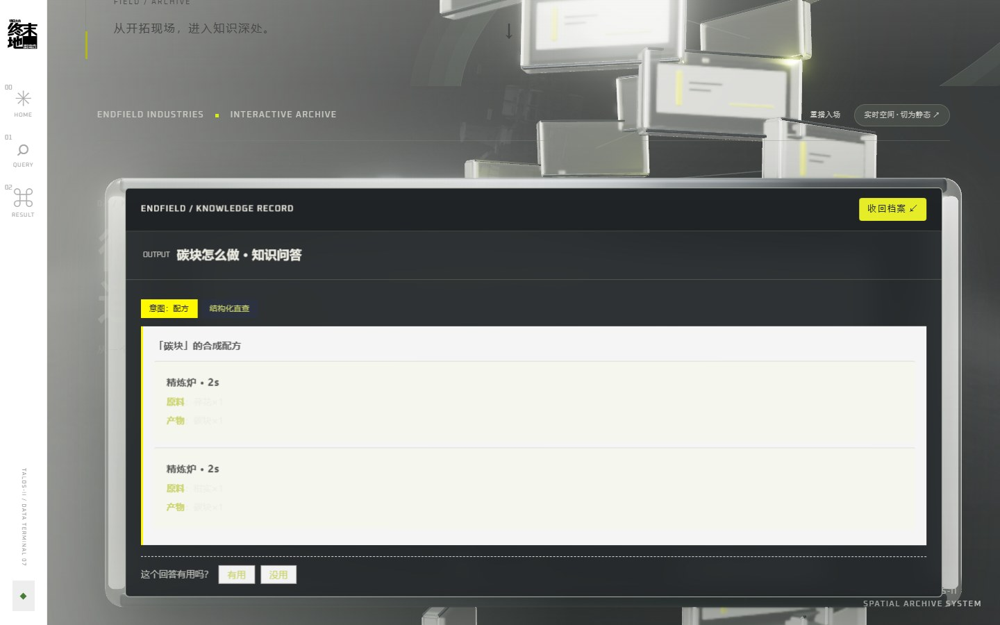
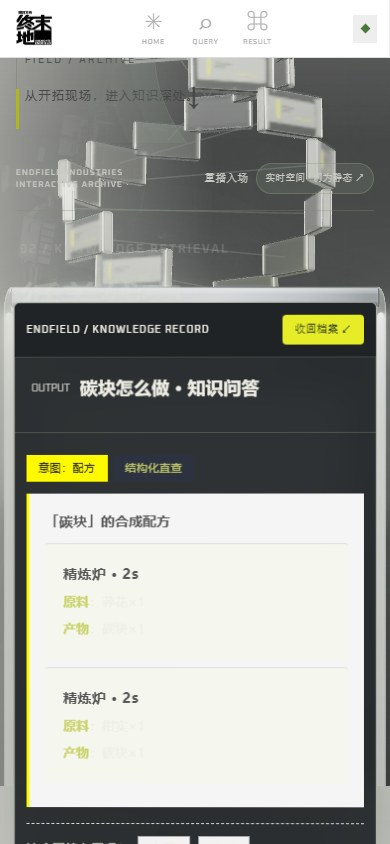

# Endfield 配方树与知识问答

基于《明日方舟：终末地》官方 WIKI 公开数据的**非官方**查询工具。

它能回答两类问题：**"这个东西怎么做？"**（顺着配方一路展开到基础资源）和**"这是什么东西？"**（从知识库与知识图谱里检索出有依据的答案）。Web 与微信小程序共用同一套 FastAPI 后端、结构化配方库、RAG 检索和知识图谱。

## 界面预览

<table>
<tr>
<td width="50%"></td>
<td width="50%"></td>
</tr>
<tr>
<td><b>首页</b>：官方角色主视觉、黄黑信息层与入口按钮，向下滚动接入共享空间。</td>
<td><b>档案区</b>：双螺旋档案阵列贯穿页面，查询控件是玻璃质感的工作台。</td>
</tr>
<tr>
<td></td>
<td></td>
</tr>
<tr>
<td><b>抽取展开</b>：提交查询后档案盒从阵列中抽出、转向镜头，展开真实结果（图为「碳块怎么做」返回的 2 条精炼炉配方）。</td>
<td><b>双模式</b>：配方合成树与知识问答共用同一入口，切换模式不会重复请求。</td>
</tr>
<tr>
<td></td>
<td></td>
</tr>
<tr>
<td><b>手机端</b>：窄屏改为纵向排布，触摸滚动交给浏览器原生行为。</td>
<td><b>移动端结果</b>：档案内容完整可读，底部保留反馈入口。</td>
</tr>
</table>

截图取自本机真实运行的前后端，其中配方数据为后端实际返回结果。

## 它做了什么

### 配方合成树

输入物品或设备名，系统从目标物品开始**纵向展开生产路径**，一路推到基础资源为止。

- **345 条真实配方**，事实源是 `output/recipes.json`，不使用 RAG 猜测配方；
- 叶子必须收敛到基础资源（清水、矿物、气体矿物或种子类），保证树能画到底；
- 每个物品最多展示 2 个配方，处理自循环并限制深度为 10，避免无限递归；
- 名称有歧义时返回候选项让用户选择，不自动猜测；找不到配方的物品回退到知识库条目；
- 树上的节点可以点击跳转，支持缩放、收起/展开与示例查询。

例：`碳块` → 精炼炉（2 秒）→ 荞花×1 或 柑实×1；`蓟花` 继续展开 → 种植机 → 蓟花种子。

### 知识问答

问自然语言问题，系统先判定**用什么方式回答**，再给出带来源的答案。

- **确定性路由优先**：配方、设备、枚举（"有哪些"）、图关系这类问题走结构化直查，**不调用大模型**，毫秒级返回且结果确定；
- **证据驱动生成**：其余问题走多路检索（名称直取 + BM25 + 向量 + 全文补充 + 实体 mention），检索到片段后才让 LLM 依据片段生成回答；
- **证据不足就明确拒答**，不编造内容；答不出比答错更可取；
- 回答附带**可点击的来源**和命中的检索片段，可以自己核对依据；
- **流式输出**：走 SSE（`phase → meta → delta → done`），阶段提示先出现、答案逐段追加，生成中途可以随时停止；
- 支持停止生成、按查询缓存、模式独立草稿与查询历史。

### 知识图谱

- **2,129 个实体、9,358 条带来源与证据的关系**；
- 覆盖从属、产出、消耗、任务前后置、推荐装备等 17 类关系；
- 支持正向、反向和是非问法，可查最多三跳路径；
- **图未命中不等于关系不存在**：没有路径时回退文本检索，不做否定推断。

### 双端客户端

- **Web**：React 18 + TypeScript + Vite 6，按需加载的 Three.js 空间层（双螺旋档案阵列、中央环、程序化档案盒）、React SVG 配方树、Markdown 渲染的来源；
- **微信小程序**：原生 WXML/WXSS + Canvas 配方树，视觉与 Web 同步，包体经过控制；
- 两端共用同一套 API 契约，接口改动会同步更新 Web 类型、小程序封装和契约测试。

### 工程与质量

- **可重建的数据链**：规范化知识库、RAG 索引、mention 索引、知识图谱、媒体索引全部由脚本生成，带来源指纹与增量更新；
- **可观测**：深度健康检查（索引一致性快照）、进程指标、脱敏调用 Trace、用户反馈隔离区与坏例回放；
- **可验证**：Python 离线回归、Web 组件测试、小程序模拟测试，加上索引审计与版本化质量门禁；
- **能降级**：未配置 LLM 时配方与检索仍可用；WebGL 不可用、系统偏好减少动效、上下文丢失都会自动降级，不影响查询功能。

## 技术栈

| 层 | 选型 |
|---|---|
| 后端 | Python 3.12、FastAPI + Pydantic v2、httpx、uvicorn |
| 检索 | `bge-small-zh-v1.5`（离线 CPU）、ChromaDB（cosine）、rank-bm25 + RRF 融合、jieba 专名词典 |
| 图谱 | SQLite 属性表 + 白名单规则提取（不用图数据库，见 [决策记录](docs/DECISIONS.md)） |
| 前端 | React 18 + TypeScript + Vite 6 + Framer Motion + Three.js；小程序原生 WXML/WXSS/Canvas |
| 质量 | unittest、Vitest + jsdom、node:test、索引审计与版本化质量门禁 |
| 交付 | Docker 多阶段构建（构建期重建索引）、Compose + Nginx、Railway 备选 |

## 快速启动

项目使用 Python 3.12、Node.js 24。本地 embedding 只允许离线加载；浏览器直连后端请使用 `127.0.0.1`。

```powershell
pip install -r requirements.txt
Set-Location web
npm ci
npm run build
Set-Location ..
python scripts/start_server.py
```

打开 `http://127.0.0.1:8000`。看到 `预热完成` 与 `Uvicorn running` 即启动成功。

未配置 LLM 时，配方、设备和知识库检索仍可使用；生成式回答会按后端规则降级。LLM 配置参考 `.env.example`，真实密钥不得提交。`start_server.py` 默认单 worker 并预热 embedding 与索引；内存紧张可设 `RAG_PREWARM=0`。

改过 `web/src` 下的代码后需要重新 `npm run build`，后端托管的是 `web/dist` 里的构建产物。

## 接口速览

| 接口 | 用途 |
|---|---|
| `GET /api/synthesis` | 配方树、设备配方卡、知识库与干员详情 |
| `POST /api/ask` | 整包知识问答（小程序、评测使用） |
| `POST /api/ask/stream` | 流式知识问答（SSE，Web 默认） |
| `GET /api/names` | 搜索联想名称表 |
| `POST /api/feedback` | 用户反馈隔离区（人工审核后才回放） |
| `GET /api/health`、`GET /api/health/deep`、`GET /api/metrics` | 存活、深度索引检查、进程指标 |
| `GET /api/media` | WIKI 图片/音频同源代理（白名单 + 大小上限） |

端点边界与流式协议见 [API.md](docs/API.md)，限流与令牌见 [API_SECURITY.md](docs/API_SECURITY.md)。

## 验证

```powershell
python -m unittest discover -s tests -v
python -m unittest scripts.test_query_routes scripts.test_api_security scripts.test_rag_trace scripts.test_ask_stream scripts.test_backend_remediation -v
python scripts/check_docs.py
Set-Location web; npm test; npm run build; Set-Location ..
node --test miniprogram/tests/ask.test.cjs
```

索引、图谱或问答逻辑改动后，再运行 `rag_audit.py --fail-on-error`、`eval_retrieval.py`、`eval_pipeline.py`、`graph_audit.py`、`quality_gate.py`。

固定评测成绩的解释与边界见 [TESTING.md](docs/TESTING.md)：Recall 100% 只代表固定检索集召回，不代表回答正确率。

## 项目结构

```text
docs/          设计、开发、测试、部署、来源与历史文档
scripts/       数据构建、检索、图谱、API 与评测工具
web/           Vite + React + TypeScript 前端
miniprogram/   微信小程序
endfield_kb/   规范化知识库产物（22 个分类）
output/        配方、索引、图谱与评测产物
tests/         Python 离线回归测试
```

原始 WIKI 数据和根目录既有历史数据文件只作事实源，不在日常开发中改写或删除。早期"生产流水线空间规划"方向已经废弃，不应重建。

## 数据来源与免责

项目数据来自《明日方舟：终末地》官方 WIKI 的公开条目，界面素材来自游戏官网等公开渠道，均经过来源登记（含 URL、字节数与 SHA256）。

本项目是**非官方社区工具**，与权利方没有隶属或合作关系，不收费、不含广告，仅供查询与学习交流。游戏名称、图像、文本及其他内容的权利归原权利方所有；查询结果以官方发布为准，不构成官方说明。

完整的素材清单、字体许可、数据来源链、使用边界与免责声明见 [素材、数据与免责声明](docs/ASSETS.md)。

## 文档

文档总入口为 [docs/README.md](docs/README.md)。建议先读：

- [当前状态](docs/PROJECT_STATE.md)：已完成、已验证与待处理事项；
- [整体架构](docs/ARCHITECTURE.md)：模块边界和请求、数据流；
- [开发指南](docs/DEVELOPMENT.md)：环境、改动规则和本地流程；
- [测试与质量](docs/TESTING.md)：分层验证、指标解释和发布门禁；
- [Web 空间体验](docs/FRONTEND_EXPERIENCE.md)：开场、共享 3D 场景、查询反馈、降级与交互不变量；
- [部署总纲](docs/DEPLOYMENT.md)：本地、服务器和 Railway 路径。
